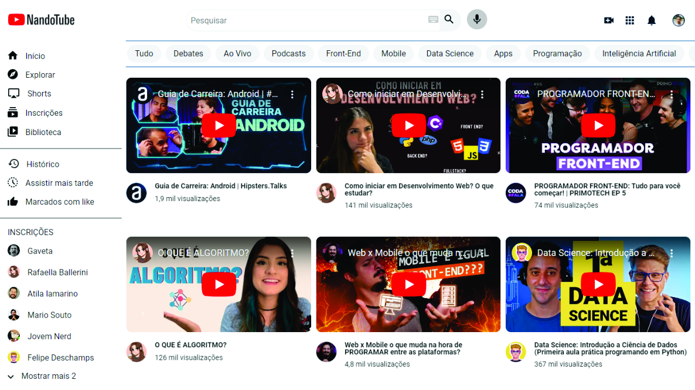
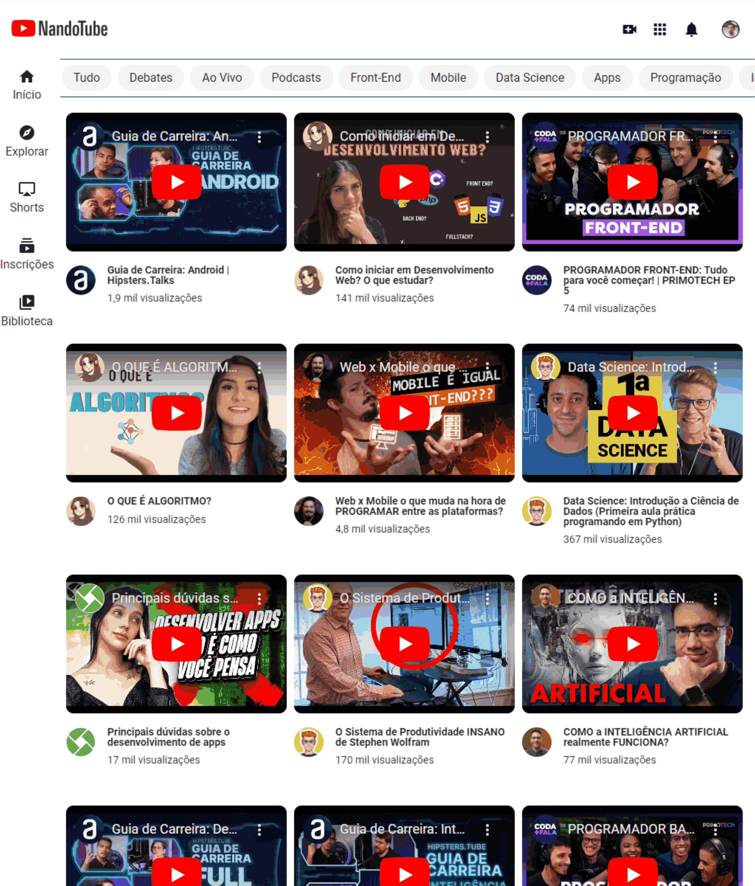
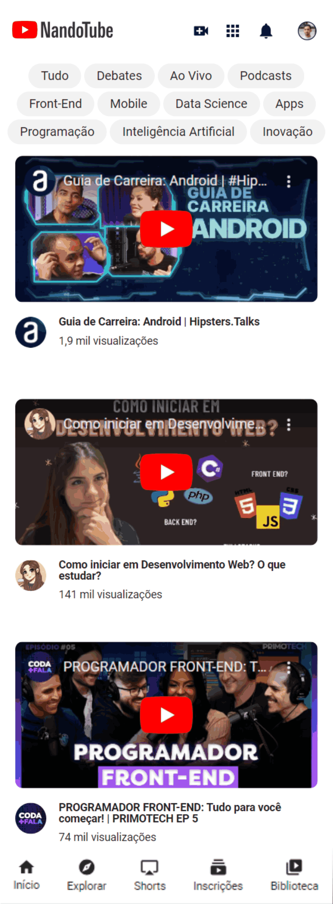

<h1>NandoTube</h1>

O projeto NandoTube é inspirado no YouTube. Buscando uma API feita por mim somente com vídeos da área de tecnologia como programação, podcast, debates, front-end, mobile e outros. Caso queira você pode digitar no input de pesquisa se tem algum vídeo do seu enteresse. O projeto também é responsivo atuando em diversos dispositivos também.

<h2>🖥️ Layout para desktop</h2>

<h2>📱 Layout para tablet</h2>

<h2>📱 Layout para mobile</h2>

<h2>Tecnologias utilizadas</h2>

<h2>Recursos do projeto</h2>

✅ Personalizado: o site foi cuidadosamente feito com imagens SVG para melhor resolução.

✅ Responsividades: O site foi cuidadosamente projetado para se adaptar de forma fluida a diferentes tamanhos de tela. Isso assegura uma experiência consistente e agradável em dispositivos móveis, tablets e desktops.

✅ Acessibilidade: Foi dada especial atenção à acessibilidade, garantindo que o site seja utilizável por todos os públicos, independentemente de suas habilidades.

<a href="https://fernando-silvaa.github.io/NandoTube/" style="background-color: grey; color: black; padding: 1rem; border-radius: 10px">Ver projeto</a>